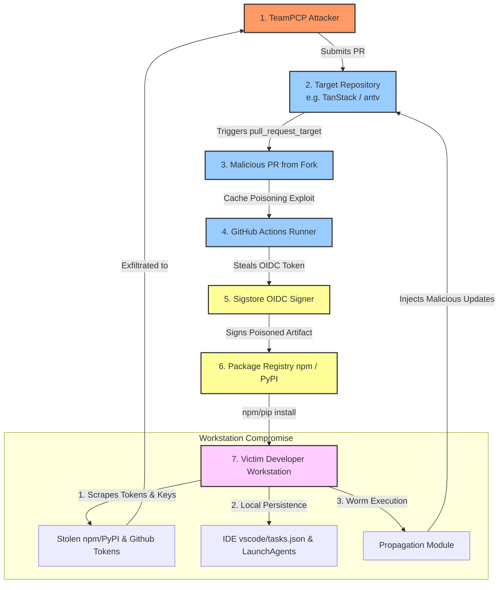

## Executive Summary
In late April and May 2026, a self-propagating supply-chain worm designated **"Mini Shai-Hulud"** hit the npm and PyPI package registries. Attributed to the threat actor group **TeamPCP**, the worm automates credential harvesting, lateral movement, and package poisoning. The campaign exploits misconfigured CI/CD pipelines (specifically via `pull_request_target` triggers and GitHub Actions cache poisoning) to steal short-lived OIDC tokens. It then uses these tokens to sign malicious updates with valid **SLSA Build Level 3 provenance badges** via **Sigstore** and publish them directly to registries.

New JFrog updates sharpen the current scope. On 2026-05-12, JFrog described an ongoing wave affecting more than **170 npm packages** and **2 PyPI packages**, totaling more than **200 million weekly downloads** [JFrog May 12](https://research.jfrog.com/post/shai-hulud-here-we-go-again/). On 2026-05-19, JFrog analyzed a separate @antv/atool wave and reported **323 legitimate packages** compromised through the `atool` npm maintainer account, plus an additional related `@cap-js/openapi@1.4.1` variant using a distinct indirect delivery technique [JFrog May 19](https://research.jfrog.com/post/shai-hulud-here-we-go-again-may19/). Defenders must treat affected systems as fully compromised and immediately rotate all credentials, remove IDE workspace and AI assistant persistence hooks, and configure package managers to ignore install lifecycle scripts.

## Key Facts
**Threat Type**: malicious package, CI/CD compromise, credential theft, self-replicating worm, build provenance failure, artifact tampering

**Ecosystem**: npm, PyPI

**Registry**: npm registry, PyPI

**Affected Packages**:
- @tanstack/react-router
- @tanstack/vue-router
- @tanstack/solid-router
- @tanstack/react-start
- @tanstack/router-core
- @antv/g2
- @antv/g6
- @antv/x6
- @antv/l7
- @antv/s2
- @antv/f2
- echarts-for-react
- timeago.js
- size-sensor
- canvas-nest.js
- @sap/cds
- @sap/cds-dk
- opensearch-py
- lite-llm
- nx-console

**Malicious Versions**:
- @tanstack/react-router@1.169.5
- @tanstack/react-router@1.169.8
- @tanstack/vue-router@1.169.5
- @tanstack/vue-router@1.169.8
- @tanstack/solid-router@1.169.5
- @tanstack/solid-router@1.169.8
- @tanstack/react-start@1.167.68
- @tanstack/react-start@1.167.71
- @antv/g2@4.2.8
- @antv/g6@4.8.24
- nx-console@18.95.0
- @antv/* published 2026-05-19T01:39:00Z through 2026-05-19T02:06:00Z (639 versions across 323 packages)
- @cap-js/openapi@1.4.1

**Fixed Versions**:
- nx-console@18.95.1

**Safe Versions**:

**Exposure Window**: 2026-04-20 to 2026-05-19T02:06:00Z (specifically May 11, 2026, 19:20–19:26 UTC for TanStack; May 19, 2026, 01:39–02:06 UTC for @antv/atool scope)

**Execution Trigger**: Install-time execution via preinstall/postinstall scripts (router_init.js or setup.mjs)

**Primary Impact**: CI/CD & cloud credential theft, lateral self-propagation, development workspace hijack, potential destructive system wipe

**Known Iocs**:
- filev2.getsession[.]org
- api.masscan[.]cloud
- git-tanstack[.]com
- t.m-kosche[.]com
- ab4fcadaec49c03278063dd269ea5eef82d24f2124a8e15d7b90f2fa8601266c
- router_init.js
- setup_bun.js
- bun_environment.js
- transformers.pyz
- gh-token-monitor

**Confidence**: high

**Canonical Source**: hxxps://tanstack[.]com/blog/postmortem-cve-2026-45321

## Evidence Assessment
*   **confirmed:**
    - Incident involving the TanStack npm packages between 19:20 and 19:26 UTC on May 11, 2026, where 84 malicious versions across 42 packages were published via hijacked OIDC tokens [TanStack Blog](https://tanstack.com/blog/postmortem-cve-2026-45321).
    - The exploit mechanism chained a `pull_request_target` misconfiguration, cache poisoning, and memory extraction of GitHub Actions OIDC tokens to publish the packages [SentinelOne](https://www.sentinelone.com/blog/anatomy-of-cve-2026-45321).
    - TeamPCP was identified as the threat actor group responsible, utilizing Dune-themed repositories for dead-drop exfiltration of credentials [Tenable](https://www.tenable.com/blog/sigstore-provenance-forgery-and-oidc-abuse).
    - The malicious payloads exfiltrated highly sensitive developer tokens, cloud credentials (AWS/GCP/Azure), Kubernetes secrets, OIDC tokens, and SSH keys [Endor Labs](https://www.endorlabs.com/blog/mini-shai-hulud-npm-worm-hits-sap-developer-packages).
    - JFrog reports the May 12 wave affected more than 170 npm packages and 2 PyPI packages, with more than 200 million weekly downloads across the affected package set [JFrog May 12](https://research.jfrog.com/post/shai-hulud-here-we-go-again/).
    - JFrog reports the May 19 @antv/atool wave compromised 323 legitimate packages and that `@cap-js/openapi@1.4.1` carried a related payload variant [JFrog May 19](https://research.jfrog.com/post/shai-hulud-here-we-go-again-may19/).
*   **likely:**
    - The execution of Bun runtime smuggling where the malware downloads `setup_bun.js` to bypass traditional Node.js static scanners and run obfuscated payloads under the Bun engine [Endor Labs](https://www.endorlabs.com/blog/mini-shai-hulud-npm-worm-hits-sap-developer-packages).
    - The use of OIDC tokens within a trusted runner context to forge valid SLSA Build Level 3 provenance badges through Sigstore, creating cryptographically "verified" malicious releases [Wiz.io](https://www.wiz.io/blog/sigstore-provenance-forgery-and-oidc-abuse).
*   **unclear:**
    - The exact number of downstream developer systems fully wiped by the "dead-man switch" payload (`rm -rf /*`) after credential revocation was initiated by security teams [Microsoft Threat Intelligence](https://www.microsoft.com/en-us/security/blog/hunting-the-shai-hulud-supply-chain-worm).
*   **not_observed:**
    - Claims that npm or PyPI registry infrastructure was directly breached; all publishes resulted from OIDC token/credential exfiltration from developer environments and CI/CD pipelines [TanStack Blog](https://tanstack.com/blog/postmortem-cve-2026-45321).

## Impact Determination

| Classification | Criteria | Required evidence | Required action | Closure condition |
| --- | --- | --- | --- | --- |
| Confirmed compromise | a package or release associated with Mini Shai-Hulud is present and package install, import, or build hook executes the worm payload or the reported process, file, or network indicators is observed. | Artifact inventory plus runtime telemetry showing package install, import, or build hook executes the worm payload or listed C2/process/file indicators. | Isolate affected hosts or runners, preserve artifacts, and rotate reachable credentials from a clean environment. | Affected artifacts are removed, exposed credentials are replaced, and downstream audit modules show no suspicious follow-on use. |
| Presumed exposed | a package or release associated with Mini Shai-Hulud was installed, pulled, imported, built, or executed during the exposure window, but telemetry cannot prove exfiltration. | Lockfile, package cache, workflow, image pull, extension inventory, build log, or deployment record tied to the exposure window. | Rebuild from clean artifacts and rotate credentials available to the affected environment. | Credential owners confirm revocation of old material and clean artifacts are deployed. |
| Potentially exposed | The package, workflow, image, extension, or module appears in dependency or deployment records, but package install, import, or build execution is not established. | Manifest, lockfile, build, deployment, or endpoint records plus a named telemetry gap. | Collect the missing execution and telemetry evidence before narrowing scope. | Every hit is dispositioned as confirmed compromise, presumed exposed, or not exposed. |
| Not exposed | No affected version, artifact, mutable reference, or indicator appears in source, lockfiles, build outputs, deployments, package caches, or runtime telemetry. | Repository search, dependency inventory, build/deployment export, package cache query, and runtime telemetry query results. | Preserve the negative search output and keep the prevention controls active. | Search evidence covers developer endpoints, CI runners, production deployments, and package or image caches. |
| Unknown | Required inventory, build, endpoint, network, or audit telemetry is unavailable. | A gap statement naming unavailable systems, owners, and time windows. | Keep the asset in scope and make conservative rotation or rebuild decisions for high-value environments. | The missing evidence is recovered or the risk owner accepts residual uncertainty. |

### Minimum Evidence To Collect

**Minimum Evidence**:
- Dependency, workflow, extension, image, or module inventory covering developer endpoints, CI runners, and production deployments.
- Positive or negative search results for campaign-specific malicious releases.
- Execution evidence for package install, import, or build hook executes the worm payload.
- Process, file, DNS, proxy, firewall, or package-manager telemetry for listed indicators.
- Inventory of credentials, tokens, deployment paths, and downstream systems reachable from exposed environments.

## Timeline
- **2026-04-20T00:00:00Z** First anomalous publishes identified in the npm registry targeting enterprise developer utilities (specifically SAP developer packages) [Endor Labs](https://www.endorlabs.com/blog/mini-shai-hulud-npm-worm-hits-sap-developer-packages).
- **2026-04-24T00:00:00Z** Endor Labs identifies the initial wave, tracing it to stolen npm publishing credentials. The malware payload is observed downloading the Bun runtime to evade standard analysis tools [Endor Labs](https://www.endorlabs.com/blog/mini-shai-hulud-npm-worm-hits-sap-developer-packages).
- **2026-05-10T00:00:00Z** The worm spreads aggressively to high-profile developer packages including `@tanstack`, `@antv`, and SDKs under Mistral AI, UiPath, and OpenSearch [Tenable](https://www.tenable.com/blog/sigstore-provenance-forgery-and-oidc-abuse).
- **2026-05-11T19:20:00Z** Attacker publishes 84 malicious versions across 42 `@tanstack/*` packages on npm [TanStack Blog](https://tanstack.com/blog/postmortem-cve-2026-45321).
- **2026-05-11T19:26:00Z** Publishing of malicious `@tanstack` versions completes [TanStack Blog](https://tanstack.com/blog/postmortem-cve-2026-45321).
- **2026-05-12T00:00:00Z** Wiz and Palo Alto Networks disclose that the malware is utilizing GitHub Actions cache poisoning and forging Sigstore provenance signatures to bypass CI/CD security filters [Wiz.io](https://www.wiz.io/blog/sigstore-provenance-forgery-and-oidc-abuse).
- **2026-05-19T00:00:00Z** Microsoft and Zscaler publish detailed hunting guides for persistent IDE hooks and LaunchAgents deployed by the worm [Microsoft Threat Intelligence](https://www.microsoft.com/en-us/security/blog/hunting-the-shai-hulud-supply-chain-worm).
- **2026-05-19T01:39:00Z** Attacker compromises the `atool` npm maintainer account (the account that manages publishing rights for the entire `@antv` npm scope) and begins publishing malicious versions across the @antv namespace [Cremit.io](https://cremit.io/blog/antv-npm-supply-chain/).
- **2026-05-19T02:06:00Z** The @antv publishing blitz ends: 639 malicious package versions published across 323 unique npm packages in 27 minutes [Cremit.io](https://cremit.io/blog/antv-npm-supply-chain/). Preinstall hooks invoking `bun run index.js` deliver a 498 KB obfuscated payload that harvests credentials from 130+ local file paths and establishes dead-drop exfiltration to `antvis/G2` repository branches via the GitHub API, with `t.m-kosche[.]com` as fallback C2 [Chainguard](https://www.chainguard.dev/unchained/atool-antv-npm-supply-chain) [StepSecurity](https://www.stepsecurity.io/blog/atool-antv-npm-supply-chain-attack).
- **2026-05-19:** JFrog publishes its @antv follow-up and adds `@cap-js/openapi@1.4.1` as a related variant with a distinct indirect delivery technique [JFrog May 19](https://research.jfrog.com/post/shai-hulud-here-we-go-again-may19/).
- **2026-05-23T01:00:00Z** Nx Console release 18.95.1 is published to patch downstream contamination resulting from the compromise of a contributor's hijacked token [SentinelOne](https://www.sentinelone.com/blog/anatomy-of-cve-2026-45321).

## What Happened
In late April 2026, the TeamPCP threat actor group launched the "Mini Shai-Hulud" supply chain campaign, targeting widely used npm and PyPI developer dependencies [Endor Labs](https://www.endorlabs.com/blog/mini-shai-hulud-npm-worm-hits-sap-developer-packages). The campaign escalated dramatically on May 11, 2026, when the worm compromised the `@tanstack` npm scope, publishing 84 poisoned versions of 42 libraries, including `@tanstack/router` and `@tanstack/react-query` [TanStack Blog](https://tanstack.com/blog/postmortem-cve-2026-45321).

Instead of stealing static npm credentials, the worm targeted the repository's GitHub Actions pipeline [SentinelOne](https://www.sentinelone.com/blog/anatomy-of-cve-2026-45321). By submitting a malicious pull request to the `TanStack/router` repository, the worm triggered a misconfigured `pull_request_target` workflow [SentinelOne](https://www.sentinelone.com/blog/anatomy-of-cve-2026-45321). Due to a cache poisoning vulnerability where fork and base workflows shared execution caches, the attacker poisoned the base branch's cache [SentinelOne](https://www.sentinelone.com/blog/anatomy-of-cve-2026-45321). When the trusted base workflow executed, it read the poisoned cache, allowing the worm to inject malicious code directly into the runner environment [SentinelOne](https://www.sentinelone.com/blog/anatomy-of-cve-2026-45321).

The worm then extracted the runner's OpenID Connect (OIDC) token from active system memory [Wiz.io](https://www.wiz.io/blog/sigstore-provenance-forgery-and-oidc-abuse). This short-lived OIDC token is trusted by the npm registry as a federated publisher identity [Wiz.io](https://www.wiz.io/blog/sigstore-provenance-forgery-and-oidc-abuse). Using this token, the attacker signed the malicious release with **Sigstore**, obtaining a valid **SLSA Build Level 3 provenance badge** [Wiz.io](https://www.wiz.io/blog/sigstore-provenance-forgery-and-oidc-abuse). This caused automated compliance tools and security scanners to trust the artifact's lineage since the signature and provenance matched the official, legitimate GitHub Actions pipeline [Wiz.io](https://www.wiz.io/blog/sigstore-provenance-forgery-and-oidc-abuse).

Once published, any developer executing `npm install` for the affected packages fell victim [Endor Labs](https://www.endorlabs.com/blog/mini-shai-hulud-npm-worm-hits-sap-developer-packages). The package lifecycle hooks executed a script that scraped host memory, environment variables, local cloud configurations, and personal access tokens [Endor Labs](https://www.endorlabs.com/blog/mini-shai-hulud-npm-worm-hits-sap-developer-packages). These stolen secrets were exfiltrated back to TeamPCP by creating public, encrypted repositories on the developer's own hijacked GitHub account, named with distinct *Dune*-themed concepts to avoid detection [Tenable](https://www.tenable.com/blog/sigstore-provenance-forgery-and-oidc-abuse).

## Technical Analysis

### Initial Access
The primary vector for initial access in the high-profile TanStack breach was the exploitation of a `pull_request_target` misconfiguration combined with GitHub Actions cache poisoning [SentinelOne](https://www.sentinelone.com/blog/anatomy-of-cve-2026-45321). An external pull request triggered the workflow in a context that had access to elevated repository secrets or OIDC trusted-publishing privileges [SentinelOne](https://www.sentinelone.com/blog/anatomy-of-cve-2026-45321). The attacker exploited a weakness where the dependency or build cache was shared between untrusted forks and trusted base runs, enabling cache poisoning [SentinelOne](https://www.sentinelone.com/blog/anatomy-of-cve-2026-45321).

### Package or Artifact Manipulation
Once execution within the runner was achieved, the worm injected the script `router_init.js` (for npm) or `setup.mjs` directly into the package structure before release generation [TanStack Blog](https://tanstack.com/blog/postmortem-cve-2026-45321). In the PyPI ecosystem, a similar payload named `transformers.pyz` was added to standard Python wheels [Endor Labs](https://www.endorlabs.com/blog/mini-shai-hulud-npm-worm-hits-sap-developer-packages). The attacker manipulated the package manifests (`package.json`) to register these files as `preinstall` or `postinstall` lifecycle hooks [Endor Labs](https://www.endorlabs.com/blog/mini-shai-hulud-npm-worm-hits-sap-developer-packages).

### Execution Trigger
When downstream developers ran dependency installation commands like `npm install` or `pip install`, the package manager automatically executed the lifecycle script under administrative or user privileges [Endor Labs](https://www.endorlabs.com/blog/mini-shai-hulud-npm-worm-hits-sap-developer-packages). In Python environments, the payload triggered during wheel unpacking or package import time [Endor Labs](https://www.endorlabs.com/blog/mini-shai-hulud-npm-worm-hits-sap-developer-packages).

### Payload Behavior
The malware checks the host environment to determine its runtime:
1. **Bun Runtime Smuggling:** It searches for the `bun` binary. If missing, it downloads a lightweight standalone Bun engine (`setup_bun.js`) from an attacker-controlled staging server [Endor Labs](https://www.endorlabs.com/blog/mini-shai-hulud-npm-worm-hits-sap-developer-packages). The main payload is executed inside Bun rather than Node.js, successfully bypassing security monitors that hook only Node.js processes or analyze standard V8 engine calls [Endor Labs](https://www.endorlabs.com/blog/mini-shai-hulud-npm-worm-hits-sap-developer-packages).
2. **Credential Harvesting:** The script scans the system for cloud credentials (AWS keys, Google Cloud JSON files, Azure profiles), container keys (Kubernetes secrets), `.npmrc` registry publishing tokens, SSH private keys, and environment variables [Endor Labs](https://www.endorlabs.com/blog/mini-shai-hulud-npm-worm-hits-sap-developer-packages).
3. **IDE and Coding Assistant Hijacking:** To establish deep local persistence, the worm targets developer tools [Microsoft Threat Intelligence](https://www.microsoft.com/en-us/security/blog/hunting-the-shai-hulud-supply-chain-worm). It appends malicious run tasks to the developer's `.vscode/tasks.json` file so that opening the workspace triggers secret exfiltration [Microsoft Threat Intelligence](https://www.microsoft.com/en-us/security/blog/hunting-the-shai-hulud-supply-chain-worm). It also places a wrapper inside `.claude/settings.json` to intercept inputs and commands passed to AI coding tools, monitoring for project structure and secrets [Microsoft Threat Intelligence](https://www.microsoft.com/en-us/security/blog/hunting-the-shai-hulud-supply-chain-worm). [1]
4. **OS Persistence:** It installs a background service named `gh-token-monitor` via a plist daemon in macOS (`~/Library/LaunchAgents/`) or a systemd unit in Linux to intercept newly generated session tokens [Microsoft Threat Intelligence](https://www.microsoft.com/en-us/security/blog/hunting-the-shai-hulud-supply-chain-worm).
5. **Dead-Man Switch / Anti-Analysis Wipe:** If the payload detects a sandbox environment (e.g., standard VM analysis indicators) or if a query to its C2 reveals that the stolen publishing token has been revoked, it launches a destructive system command (`rm -rf /*`) to destroy evidence and disrupt incident response [Microsoft Threat Intelligence](https://www.microsoft.com/en-us/security/blog/hunting-the-shai-hulud-supply-chain-worm). [1]

### Exfiltration / C2
**Domains**:
- filev2.getsession[.]org
- api.masscan[.]cloud
- git-tanstack[.]com
- t.m-kosche[.]com

**Ips**:
- N/A

**Urls**:
- https://filev2.getsession[.]org/upload
- https://api.masscan[.]cloud/ping

**Protocols**:
- HTTPS
- DNS

**Endpoints**:
- /upload
- /ping

**Confidence**: high

### Propagation
The worm is self-propagating [Tenable](https://www.tenable.com/blog/sigstore-provenance-forgery-and-oidc-abuse). Upon harvesting npm and PyPI publishing tokens from compromised workstations or CI runners, it sends them back to the C2 or uses them locally to identify other repositories accessible to that developer [Tenable](https://www.tenable.com/blog/sigstore-provenance-forgery-and-oidc-abuse). The malware automatically modifies those downstream packages, signs them, and publishes infected versions to the registry under the developer's identity, continuing its exponential spread across the supply chain [Tenable](https://www.tenable.com/blog/sigstore-provenance-forgery-and-oidc-abuse). [1]

### Obfuscation or Evasion
In addition to Bun runtime smuggling, the worm hides its payload using complex XOR obfuscation and packs its Python components into a zipapp (`transformers.pyz`) [Endor Labs](https://www.endorlabs.com/blog/mini-shai-hulud-npm-worm-hits-sap-developer-packages). The use of forged Sigstore certificates allows it to bypass cryptographic strictness policies that require verified build provenance [Wiz.io](https://www.wiz.io/blog/sigstore-provenance-forgery-and-oidc-abuse).

### Worm Self-Propagation Lifecycle
The following architectural flowchart details the self-replicating loop utilized by the TeamPCP worm to propagate through GitHub, package registries, and developer workstations:



## Affected Assets and Blast Radius
**Affected Assets**:
  - **ecosystems**: npm,PyPI
  - **packages**: @tanstack/router,@tanstack/react-query,@tanstack/store,@antv/g2,@antv/g6,@sap/cds,@sap/cds-dk,opensearch-py,lite-llm,nx-console
  - **versions**: @tanstack/* published on May 11, 2026,nx-console@18.95.0
  - **repositories**: github.com/TanStack/router,github.com/antvis/*,github.com/nrwl/nx-console
  - **container_images**: N/A
  - **CI_CD_systems**: GitHub Actions
  - **developer_tools**: VS Code,Claude Code
  - **environments**: developer workstations,CI runners,build pipelines,containers,production systems

**Credentials At Risk**:
- npm tokens
- GitHub tokens
- cloud credentials
- SSH keys
- environment variables

**Not Currently Known To Affect**:
- Non-NodeJS/Non-Python development environments lacking Bun and Python command-line tools.

## Indicators of Compromise
The following indicators of compromise (IOCs) can be used to scope exposure across local repositories, systems, and telemetry exports:

### Hashes
- ab4fcadaec49c03278063dd269ea5eef82d24f2124a8e15d7b90f2fa8601266c

### Domains
- transformers.pyz
- filev2[.]getsession[.]org
- api.masscan.cloud
- git-tanstack[.]com
- t[.]m-kosche[.]com
- www[.]endorlabs[.]com
- www[.]microsoft[.]com
- www[.]sentinelone[.]com

### Urls
- hxxps://filev2[.]getsession[.]org/upload
- hxxps://api[.]masscan[.]cloud/ping
- hxxps://www[.]endorlabs[.]com/blog/mini-shai-hulud-npm-worm-hits-sap-developer-packages
- hxxps://tanstack[.]com/blog/postmortem-cve-2026-45321
- hxxps://www[.]microsoft[.]com/en-us/security/blog/hunting-the-shai-hulud-supply-chain-worm
- hxxps://www[.]sentinelone[.]com/blog/anatomy-of-cve-2026-45321


## Detection and Hunting

### Hunt Manifest: mini-shai-hulud-worm-hunt-1
- **Title:** local repository and exported telemetry scope
- **Question:** Does the telemetry scope contain patterns associated with Mini Shai-Hulud Self-Propagating Software Supply Chain Worm?
- **Telemetry Family:** process
- **Telemetry Context:** host filesystem or log export
- **Positive Signal:** Indicators of compromise matched in telemetry: local repository and exported telemetry scope

```py
#!/usr/bin/env python3
"""Generic IOC scope scanner for mini-shai-hulud-worm.

Searches repository trees and exported logs for literal IOC values from iocs.json.
Exit codes:
  0: no matches
  1: one or more indicators matched
  2: execution error
"""
import argparse
import fnmatch
import os
import sys
from pathlib import Path

OUT = Path(os.environ.get("OUT", "hp-mini-shai-hulud-worm-ioc-scope"))
CONTENT_INDICATORS = [
  "@tanstack/react-router@1.169.5",
  "@tanstack/react-router@1.169.8",
  "@tanstack/vue-router@1.169.5",
  "@tanstack/vue-router@1.169.8",
  "@tanstack/solid-router@1.169.5",
  "@tanstack/solid-router@1.169.8",
  "@tanstack/react-start@1.167.68",
  "@tanstack/react-start@1.167.71",
  "@antv/g2@4.2.8",
  "@antv/g6@4.8.24",
  "nx-console@18.95.0",
  "@tanstack/router-core@1.169.5",
  "@antv/x6@2.2.0",
  "@antv/l7@2.19.0",
  "@antv/s2@1.30.0",
  "@antv/f2@4.1.0",
  "echarts-for-react@3.0.0",
  "timeago.js@4.0.2",
  "size-sensor@1.0.1",
  "canvas-nest.js@2.0.4",
  "@sap/cds@7.9.2",
  "@sap/cds-dk@7.9.2",
  "opensearch-py@2.5.0",
  "lite-llm@1.34.0",
  "ab4fcadaec49c03278063dd269ea5eef82d24f2124a8e15d7b90f2fa8601266c",
  "filev2[.]getsession[.]org",
  "api.masscan.cloud",
  "git-tanstack[.]com",
  "t[.]m-kosche[.]com",
  "www[.]endorlabs[.]com",
  "www.microsoft.com",
  "www[.]sentinelone[.]com",
  "https://filev2.getsession.org/upload",
  "https://api.masscan.cloud/ping",
  "https://www.endorlabs.com/blog/mini-shai-hulud-npm-worm-hits-sap-developer-packages",
  "https://tanstack.com/blog/postmortem-cve-2026-45321",
  "https://www.microsoft.com/en-us/security/blog/hunting-the-shai-hulud-supply-chain-worm",
  "https://www.sentinelone.com/blog/anatomy-of-cve-2026-45321",
  "@tanstack/react-router",
  "1.169.5",
  "1.169.8",
  "@tanstack/vue-router",
  "@tanstack/solid-router",
  "@tanstack/react-start",
  "1.167.68",
  "1.167.71",
  "@antv/g2",
  "4.2.8",
  "@antv/g6",
  "4.8.24",
  "nx-console",
  "18.95.0",
  "@tanstack/router-core",
  "@antv/x6",
  "2.2.0",
  "@antv/l7",
  "2.19.0",
  "@antv/s2",
  "1.30.0",
  "@antv/f2",
  "4.1.0",
  "echarts-for-react",
  "3.0.0",
  "timeago.js",
  "4.0.2",
  "size-sensor",
  "1.0.1",
  "canvas-nest.js",
  "2.0.4",
  "@sap/cds",
  "7.9.2",
  "@sap/cds-dk",
  "opensearch-py",
  "2.5.0",
  "lite-llm",
  "1.34.0"
]
PATH_INDICATORS = [
  "router_init.js",
  "setup_bun.js",
  "bun_environment.js",
  "transformers.pyz",
  "gh-token-monitor"
]
EXCLUDE_DIRS = {".git", "node_modules", "vendor", "dist", "build", ".venv", "__pycache__"}

def _iter_files(root):
    root = Path(root)
    if not root.exists():
        return
    if root.is_file():
        yield root
        return
    for current, dirs, files in os.walk(root):
        dirs[:] = [d for d in dirs if d not in EXCLUDE_DIRS]
        for name in files:
            yield Path(current) / name

def _path_matches(path):
    text = str(path)
    matches = []
    for indicator in PATH_INDICATORS:
        if not indicator:
            continue
        if indicator.startswith(("/", "~")):
            candidate = Path(os.path.expanduser(indicator))
            if candidate.exists() and path == candidate:
                matches.append(indicator)
        if indicator in text or fnmatch.fnmatch(text, indicator) or fnmatch.fnmatch(path.name, indicator):
            matches.append(indicator)
    return matches

def _content_matches(path):
    try:
        content = path.read_text(errors="ignore")
    except Exception:
        return []
    return [indicator for indicator in CONTENT_INDICATORS if indicator and indicator in content]

def _scan_roots(roots):
    matches = []
    for root in roots:
        if not root:
            continue
        for path in _iter_files(root):
            for indicator in _path_matches(path):
                matches.append(f"{path}: path matched {indicator!r}")
            for indicator in _content_matches(path):
                matches.append(f"{path}: content matched {indicator!r}")
    return matches

def main():
    parser = argparse.ArgumentParser(description="Scan files and logs for Halting Problems IOC values")
    parser.add_argument("roots", nargs="*", default=["."], help="File or directory roots to scan")
    parser.add_argument("--log-root", default=os.environ.get("LOG_ROOT", ""), help="Optional exported log directory")
    args = parser.parse_args()

    OUT.mkdir(parents=True, exist_ok=True)
    indicator_lines = sorted(set(CONTENT_INDICATORS + PATH_INDICATORS))
    (OUT / "ioc-indicators.txt").write_text("\n".join(indicator_lines) + "\n")

    roots = list(args.roots)
    if args.log_root:
        roots.append(args.log_root)
    matches = _scan_roots(roots)
    if matches:
        (OUT / "ioc-scope-matches.txt").write_text("\n".join(matches) + "\n")
        print(f"[!] Found {len(matches)} IOC matches; details written under {OUT}")
        return 1
    print(f"[+] No IOC matches found; indicator inventory written under {OUT}")
    return 0

if __name__ == "__main__":
    try:
        sys.exit(main())
    except Exception as exc:
        print(f"[-] Execution failure: {exc}", file=sys.stderr)
        sys.exit(2)
```

### Hunt Manifest: mini-shai-hulud-worm-hunt-2
- **Title:** local repository and exported telemetry scope
- **Question:** Does the telemetry scope contain patterns associated with Mini Shai-Hulud Self-Propagating Software Supply Chain Worm?
- **Telemetry Family:** file
- **Telemetry Context:** host filesystem or log export
- **Positive Signal:** Indicators of compromise matched in telemetry: local repository and exported telemetry scope

```py
#!/usr/bin/env python3
"""Generic IOC scope scanner for mini-shai-hulud-worm.

Searches repository trees and exported logs for literal IOC values from iocs.json.
Exit codes:
  0: no matches
  1: one or more indicators matched
  2: execution error
"""
import argparse
import fnmatch
import os
import sys
from pathlib import Path

OUT = Path(os.environ.get("OUT", "hp-mini-shai-hulud-worm-ioc-scope"))
CONTENT_INDICATORS = [
  "@tanstack/react-router@1.169.5",
  "@tanstack/react-router@1.169.8",
  "@tanstack/vue-router@1.169.5",
  "@tanstack/vue-router@1.169.8",
  "@tanstack/solid-router@1.169.5",
  "@tanstack/solid-router@1.169.8",
  "@tanstack/react-start@1.167.68",
  "@tanstack/react-start@1.167.71",
  "@antv/g2@4.2.8",
  "@antv/g6@4.8.24",
  "nx-console@18.95.0",
  "@tanstack/router-core@1.169.5",
  "@antv/x6@2.2.0",
  "@antv/l7@2.19.0",
  "@antv/s2@1.30.0",
  "@antv/f2@4.1.0",
  "echarts-for-react@3.0.0",
  "timeago.js@4.0.2",
  "size-sensor@1.0.1",
  "canvas-nest.js@2.0.4",
  "@sap/cds@7.9.2",
  "@sap/cds-dk@7.9.2",
  "opensearch-py@2.5.0",
  "lite-llm@1.34.0",
  "ab4fcadaec49c03278063dd269ea5eef82d24f2124a8e15d7b90f2fa8601266c",
  "filev2[.]getsession[.]org",
  "api.masscan.cloud",
  "git-tanstack[.]com",
  "t[.]m-kosche[.]com",
  "www[.]endorlabs[.]com",
  "www.microsoft.com",
  "www[.]sentinelone[.]com",
  "https://filev2.getsession.org/upload",
  "https://api.masscan.cloud/ping",
  "https://www.endorlabs.com/blog/mini-shai-hulud-npm-worm-hits-sap-developer-packages",
  "https://tanstack.com/blog/postmortem-cve-2026-45321",
  "https://www.microsoft.com/en-us/security/blog/hunting-the-shai-hulud-supply-chain-worm",
  "https://www.sentinelone.com/blog/anatomy-of-cve-2026-45321",
  "@tanstack/react-router",
  "1.169.5",
  "1.169.8",
  "@tanstack/vue-router",
  "@tanstack/solid-router",
  "@tanstack/react-start",
  "1.167.68",
  "1.167.71",
  "@antv/g2",
  "4.2.8",
  "@antv/g6",
  "4.8.24",
  "nx-console",
  "18.95.0",
  "@tanstack/router-core",
  "@antv/x6",
  "2.2.0",
  "@antv/l7",
  "2.19.0",
  "@antv/s2",
  "1.30.0",
  "@antv/f2",
  "4.1.0",
  "echarts-for-react",
  "3.0.0",
  "timeago.js",
  "4.0.2",
  "size-sensor",
  "1.0.1",
  "canvas-nest.js",
  "2.0.4",
  "@sap/cds",
  "7.9.2",
  "@sap/cds-dk",
  "opensearch-py",
  "2.5.0",
  "lite-llm",
  "1.34.0"
]
PATH_INDICATORS = [
  "router_init.js",
  "setup_bun.js",
  "bun_environment.js",
  "transformers.pyz",
  "gh-token-monitor"
]
EXCLUDE_DIRS = {".git", "node_modules", "vendor", "dist", "build", ".venv", "__pycache__"}

def _iter_files(root):
    root = Path(root)
    if not root.exists():
        return
    if root.is_file():
        yield root
        return
    for current, dirs, files in os.walk(root):
        dirs[:] = [d for d in dirs if d not in EXCLUDE_DIRS]
        for name in files:
            yield Path(current) / name

def _path_matches(path):
    text = str(path)
    matches = []
    for indicator in PATH_INDICATORS:
        if not indicator:
            continue
        if indicator.startswith(("/", "~")):
            candidate = Path(os.path.expanduser(indicator))
            if candidate.exists() and path == candidate:
                matches.append(indicator)
        if indicator in text or fnmatch.fnmatch(text, indicator) or fnmatch.fnmatch(path.name, indicator):
            matches.append(indicator)
    return matches

def _content_matches(path):
    try:
        content = path.read_text(errors="ignore")
    except Exception:
        return []
    return [indicator for indicator in CONTENT_INDICATORS if indicator and indicator in content]

def _scan_roots(roots):
    matches = []
    for root in roots:
        if not root:
            continue
        for path in _iter_files(root):
            for indicator in _path_matches(path):
                matches.append(f"{path}: path matched {indicator!r}")
            for indicator in _content_matches(path):
                matches.append(f"{path}: content matched {indicator!r}")
    return matches

def main():
    parser = argparse.ArgumentParser(description="Scan files and logs for Halting Problems IOC values")
    parser.add_argument("roots", nargs="*", default=["."], help="File or directory roots to scan")
    parser.add_argument("--log-root", default=os.environ.get("LOG_ROOT", ""), help="Optional exported log directory")
    args = parser.parse_args()

    OUT.mkdir(parents=True, exist_ok=True)
    indicator_lines = sorted(set(CONTENT_INDICATORS + PATH_INDICATORS))
    (OUT / "ioc-indicators.txt").write_text("\n".join(indicator_lines) + "\n")

    roots = list(args.roots)
    if args.log_root:
        roots.append(args.log_root)
    matches = _scan_roots(roots)
    if matches:
        (OUT / "ioc-scope-matches.txt").write_text("\n".join(matches) + "\n")
        print(f"[!] Found {len(matches)} IOC matches; details written under {OUT}")
        return 1
    print(f"[+] No IOC matches found; indicator inventory written under {OUT}")
    return 0

if __name__ == "__main__":
    try:
        sys.exit(main())
    except Exception as exc:
        print(f"[-] Execution failure: {exc}", file=sys.stderr)
        sys.exit(2)
```

## Downstream Abuse Audits
Compromised workstations expose active API credentials, requiring immediate rotated revocation. The following platforms are at risk:
- **GitHub OIDC and PATs**: Attackers harvested SSH private keys and Git Personal Access Tokens. Auditors must inspect recent action runs and release logs during the exposure window.
- **Cloud IAM Credentials**: AWS, Azure, and GCP session tokens. CloudTrail and Activity Logs should be queried for AssumeRole or write operations originating from unexpected IP addresses.
- **NPM and Package Registries**: Publishing tokens and credentials. Registry profiles must be audited for unauthorized version publishes or token additions.

## Sources
1. [TanStack Blog](https://tanstack.com/blog/postmortem-cve-2026-45321). **Role:** DIRECT_SOURCE **Impact:** Detailed explanation of the TanStack compromise, the exact exposure window (19:20 - 19:26 UTC), affected packages, and the OIDC exploitation chain.
2. [SentinelOne](https://www.sentinelone.com/blog/anatomy-of-cve-2026-45321). **Role:** PRIMARY_RESEARCH **Impact:** Deep technical walkthrough of the cache-poisoning exploit, the `pull_request_target` misconfiguration, and downstream Nx Console compromise.
3. [Endor Labs](https://www.endorlabs.com/blog/mini-shai-hulud-npm-worm-hits-sap-developer-packages). **Role:** PRIMARY_RESEARCH **Impact:** Initial discovery of the worm's SAP CAP targets, Bun runtime smuggling, and Python `transformers.pyz` payload.
4. [Wiz.io](https://www.wiz.io/blog/sigstore-provenance-forgery-and-oidc-abuse). **Role:** PRIMARY_RESEARCH **Impact:** Analysis of the Sigstore SLSA Build Level 3 provenance forgery and the federation bypass.
5. [Tenable](https://www.tenable.com/blog/sigstore-provenance-forgery-and-oidc-abuse). **Role:** SECONDARY_ANALYSIS **Impact:** Discussion of TeamPCP's Dune-themed indicators, exfiltration repositories, and worm-like lateral movement.
6. [Microsoft Threat Intelligence](https://www.microsoft.com/en-us/security/blog/hunting-the-shai-hulud-supply-chain-worm). **Role:** PRIMARY_RESEARCH **Impact:** Identification of the persistent IDE task hooks, macOS/Linux LaunchAgent services, and the credential revocation dead-man switch behavior.
7. [Aikido Security](https://www.aikido.dev/blog/the-may-2026-supply-chain-wave). **Role:** SECONDARY_ANALYSIS **Impact:** Overall synthesis of the massive May 2026 supply chain wave and remediation recommendations.
8. [Orca Security](https://orca.security/resources/blog/atool-antv-npm-supply-chain-attack/). **Role:** PRIMARY_RESEARCH **Impact:** Technical analysis of the 323-package @antv namespace compromise, 27-minute attack window, preinstall hook execution via Bun, credential harvesting from 130+ file paths.
9. [Palo Alto Networks Unit42](https://unit42.paloaltonetworks.com/shai-hulud-here-we-go-again/). **Role:** PRIMARY_RESEARCH **Impact:** Attribution to TeamPCP Mini Shai-Hulud campaign, correlation with prior waves, worm propagation analysis.
10. [Chainguard](https://www.chainguard.dev/unchained/atool-antv-npm-supply-chain). **Role:** PRIMARY_RESEARCH **Impact:** Payload analysis: 498 KB obfuscated JS, Bun execution, antvis/G2 dead-drop via GitHub API, t[.]m-kosche[.]com fallback C2.
11. [StepSecurity](https://www.stepsecurity.io/blog/atool-antv-npm-supply-chain-attack). **Role:** DIRECT_SOURCE **Impact:** Dead-drop commit analysis in antvis/G2 repo, 130+ credential file paths targeted, GitHub API exfiltration mechanism.
12. [Cremit.io](https://cremit.io/blog/antv-npm-supply-chain/). **Role:** SECONDARY_ANALYSIS **Impact:** 01:39–02:06 UTC attack window timing, 639 malicious versions across 323 packages, package list.
13. [JFrog: Shai-Hulud, Here We Go Again](https://research.jfrog.com/post/shai-hulud-here-we-go-again/). **Role:** PRIMARY_RESEARCH **Impact:** Broader May 12 campaign scope across 170+ npm packages and 2 PyPI packages with 200M+ weekly downloads, credential theft, encrypted exfiltration, and destructive dead-man switch behavior.
14. [JFrog: Shai-Hulud Returns: npm Worm hits @antv](https://research.jfrog.com/post/shai-hulud-here-we-go-again-may19/). **Role:** PRIMARY_RESEARCH **Impact:** Confirms 323 legitimate packages in the @antv/atool wave and identifies `@cap-js/openapi@1.4.1` as a related payload variant.
