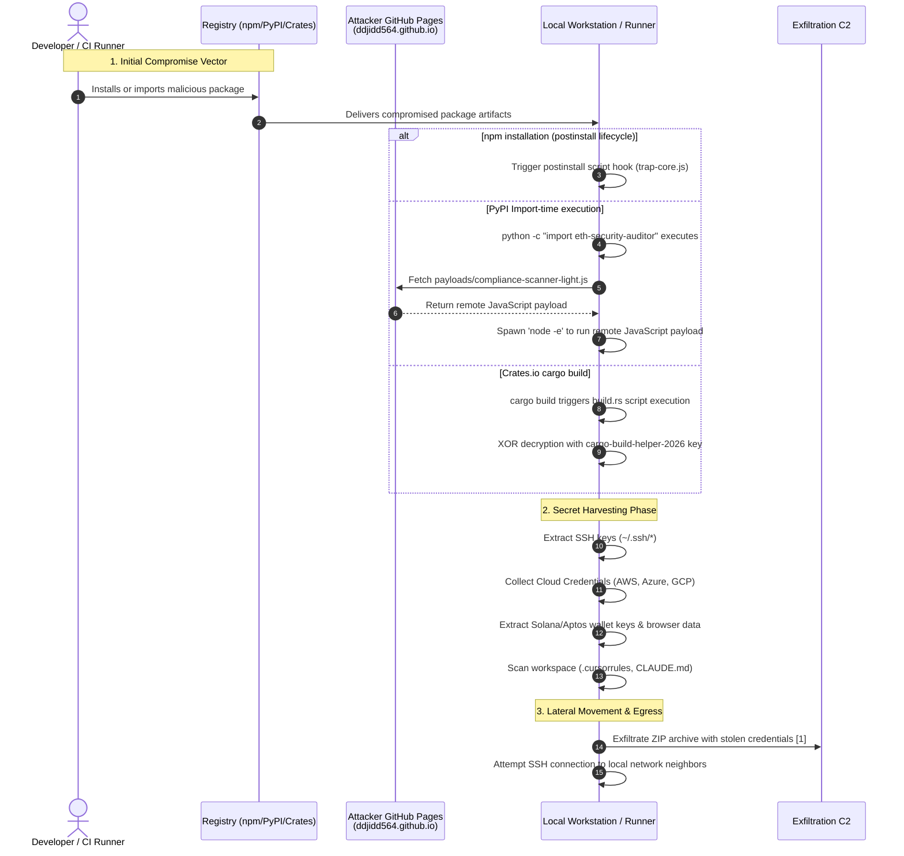

## Executive Summary
TrapDoor is an active software supply-chain campaign reported by Socket on May 24, 2026, spanning npm, PyPI, and Crates.io packages aimed at crypto, DeFi, AI, and developer-security workflows [Socket](https://socket.dev/blog/trapdoor-crypto-stealer-npm-pypi-crates). Socket tracks more than 34 malicious packages and 384 or more related versions/artifacts, while OSV already lists several PyPI malicious-package records tied to the same `2026-05-eth-security-auditor` campaign [Socket](https://socket.dev/blog/trapdoor-crypto-stealer-npm-pypi-crates) [OSV PyPI list](https://osv.dev/list?ecosystem=PyPI).

The campaign is notable because each ecosystem gets a native execution path: npm postinstall hooks, PyPI import-time loaders that execute remote JavaScript, and Rust `build.rs` scripts that run during compilation [Socket](https://socket.dev/blog/trapdoor-crypto-stealer-npm-pypi-crates). The payloads target SSH keys, GitHub tokens, AWS and cloud credentials, browser data, environment variables, crypto wallet material, and AI assistant instruction surfaces such as `.cursorrules` and `CLAUDE.md` [Socket](https://socket.dev/blog/trapdoor-crypto-stealer-npm-pypi-crates) [GitHub repo](https://github.com/ddjidd564/defi-security-best-practices/tree/gh-pages).

## Key Facts
**Threat Type**: cross-registry malicious package campaign

**Ecosystem**: npm, PyPI, Crates.io

**Registry**: npmjs.com, pypi.org, crates.io

**Affected Packages**:
  - **npm**: async-pipeline-builder,build-scripts-utils,chain-key-validator,crypto-credential-scanner,defi-env-auditor,defi-threat-scanner,deployment-key-auditor,dev-env-bootstrapper,eth-wallet-sentinel,llm-context-compressor,mnemonic-safety-check,model-switch-router,node-setup-helpers,project-init-tools,prompt-engineering-toolkit,solidity-deploy-guard,token-usage-tracker,wallet-backup-verifier,wallet-security-checker,web3-secrets-detector,workspace-config-loader
  - **pypi**: cryptowallet-safety,data-pipeline-check,defi-risk-scanner,env-loader-cli,eth-security-auditor,git-config-sync,solidity-build-guard
  - **crates**: move-analyzer-build,move-compiler-tools,move-project-builder,sui-framework-helpers,sui-move-build-helper,sui-sdk-build-utils

**Malicious Versions**:
- env-loader-cli@0.1.0
- env-loader-cli@0.1.1
- eth-security-auditor@0.1.0
- sui-framework-helpers@0.1.0

**Known Good Versions**:

**Fixed Or Safe Versions**:

**Execution Trigger**: npm postinstall, Python import, Rust build.rs

**Primary Impact**: developer secret theft, cloud credential theft, SSH lateral movement, crypto wallet theft, AI assistant instruction poisoning

**Campaign Context**: active cross-ecosystem campaign tracked by Socket as TrapDoor

**Confidence**: medium

**Canonical Source**: https://socket.dev/blog/trapdoor-crypto-stealer-npm-pypi-crates

**Last Verified**: 2026-05-24

## Evidence Assessment
- **confirmed:** Socket reports TrapDoor as a cross-ecosystem campaign across npm, PyPI, and Crates.io, with 34+ malicious packages and 384+ related versions/artifacts [Socket](https://socket.dev/blog/trapdoor-crypto-stealer-npm-pypi-crates).
- **confirmed:** OSV lists recent malicious PyPI package records for `env-loader-cli`, `data-pipeline-check`, `git-config-sync`, `defi-risk-scanner`, `cryptowallet-safety`, `solidity-build-guard`, and `eth-security-auditor` [OSV PyPI list](https://osv.dev/list?ecosystem=PyPI).
- **confirmed:** OSV record `MAL-2026-4272` says `env-loader-cli` runs code during import to exfiltrate credentials, private keys, and sensitive data, and it lists affected versions `0.1.0` and `0.1.1` [OSV MAL-2026-4272](https://osv.dev/vulnerability/MAL-2026-4272).
- **confirmed:** The attacker-controlled GitHub repository `ddjidd564/defi-security-best-practices` exists on the `gh-pages` branch and exposes directories and files matching Socket's infrastructure reporting, including `payloads`, `trap-core`, `.cursorrules`, and `CLAUDE.md` [GitHub repo](https://github.com/ddjidd564/defi-security-best-practices/tree/gh-pages).
- **likely:** The campaign scope will continue to change because Socket describes the activity as active and says some packages were already removed while others were still live at publication time [Socket](https://socket.dev/blog/trapdoor-crypto-stealer-npm-pypi-crates).
- **unclear:** No public source reviewed here proves real-world victim count, complete registry removal status, or actor attribution beyond the observed GitHub account and package publishers.

## Impact Determination

| Classification | Criteria | Required evidence | Required action | Closure condition |
| --- | --- | --- | --- | --- |
| Confirmed compromise | a TrapDoor npm, PyPI, or Crates.io package is present and npm postinstall, Python import-time loader, or Rust `build.rs` executes or the reported process, file, or network indicators is observed. | Artifact inventory plus runtime telemetry showing npm postinstall, Python import-time loader, or Rust `build.rs` executes or listed C2/process/file indicators. | Isolate affected hosts or runners, preserve artifacts, and rotate reachable credentials from a clean environment. | Affected artifacts are removed, exposed credentials are replaced, and downstream audit modules show no suspicious follow-on use. |
| Presumed exposed | a TrapDoor npm, PyPI, or Crates.io package was installed, pulled, imported, built, or executed during the exposure window, but telemetry cannot prove exfiltration. | Lockfile, package cache, workflow, image pull, extension inventory, build log, or deployment record tied to the exposure window. | Rebuild from clean artifacts and rotate credentials available to the affected environment. | Credential owners confirm revocation of old material and clean artifacts are deployed. |
| Potentially exposed | The package, workflow, image, extension, or module appears in dependency or deployment records, but package install, import, or build execution is not established. | Manifest, lockfile, build, deployment, or endpoint records plus a named telemetry gap. | Collect the missing execution and telemetry evidence before narrowing scope. | Every hit is dispositioned as confirmed compromise, presumed exposed, or not exposed. |
| Not exposed | No affected version, artifact, mutable reference, or indicator appears in source, lockfiles, build outputs, deployments, package caches, or runtime telemetry. | Repository search, dependency inventory, build/deployment export, package cache query, and runtime telemetry query results. | Preserve the negative search output and keep the prevention controls active. | Search evidence covers developer endpoints, CI runners, production deployments, and package or image caches. |
| Unknown | Required inventory, build, endpoint, network, or audit telemetry is unavailable. | A gap statement naming unavailable systems, owners, and time windows. | Keep the asset in scope and make conservative rotation or rebuild decisions for high-value environments. | The missing evidence is recovered or the risk owner accepts residual uncertainty. |

### Minimum Evidence To Collect

**Minimum Evidence**:
- Dependency, workflow, extension, image, or module inventory covering developer endpoints, CI runners, and production deployments.
- Positive or negative search results for env-loader-cli 0.1.0, env-loader-cli 0.1.1, eth-security-auditor 0.1.0, sui-framework-helpers 0.1.0.
- Execution evidence for npm postinstall, Python import-time loader, or Rust `build.rs` executes.
- Process, file, DNS, proxy, firewall, or package-manager telemetry for listed indicators.
- Inventory of credentials, tokens, deployment paths, and downstream systems reachable from exposed environments.

## Timeline
- **2026-05-22T20:20:18Z** Socket's earliest observed package, `eth-security-auditor@0.1.0`, is uploaded to PyPI [Socket](https://socket.dev/blog/trapdoor-crypto-stealer-npm-pypi-crates).
- **2026-05-22T20:22:04Z** Socket reports the `eth-security-auditor` wheel publication time [Socket](https://socket.dev/blog/trapdoor-crypto-stealer-npm-pypi-crates).
- **2026-05-24T05:42:09Z** OSV publishes `MAL-2026-4272` for `env-loader-cli` [OSV MAL-2026-4272](https://osv.dev/vulnerability/MAL-2026-4272).
- **2026-05-24** Socket publishes public TrapDoor campaign research [Socket](https://socket.dev/blog/trapdoor-crypto-stealer-npm-pypi-crates).
- **2026-05-24** This local feed check found no existing Halting Problems coverage for `TrapDoor`, `ddjidd564`, `eth-security-auditor`, `env-loader-cli`, `sui-framework-helpers`, `trap-core.js`, or `ddjidd564.github.io`.

## What Happened
Attackers published packages with benign-sounding names that map to high-value developer workflows: wallet checking, DeFi risk scanning, Solidity deployment validation, model routing, prompt engineering, environment bootstrapping, and Sui/Move build helpers [Socket](https://socket.dev/blog/trapdoor-crypto-stealer-npm-pypi-crates). That naming strategy matters because developers in crypto, AI, and security tooling are more likely to have valuable SSH keys, cloud tokens, GitHub credentials, and wallet files on the same machines where package installation happens.

The campaign does not rely on one registry-specific trick. Socket reports npm postinstall execution, PyPI import-time execution that downloads JavaScript from attacker-controlled GitHub Pages and runs it with `node -e`, and Crates.io `build.rs` execution during Rust compilation [Socket](https://socket.dev/blog/trapdoor-crypto-stealer-npm-pypi-crates). OSV corroborates the PyPI side for `env-loader-cli`, stating that the package executes during import and exfiltrates credentials, private keys, and sensitive data [OSV MAL-2026-4272](https://osv.dev/vulnerability/MAL-2026-4272).

## Technical Analysis
### Initial Access
The known initial access vector is package publication to public registries rather than compromise of an established upstream project. Socket lists packages across npm, PyPI, and Crates.io, and OSV confirms malicious PyPI package entries associated with campaign `2026-05-eth-security-auditor` [Socket](https://socket.dev/blog/trapdoor-crypto-stealer-npm-pypi-crates) [OSV MAL-2026-4272](https://osv.dev/vulnerability/MAL-2026-4272).

### Package or Artifact Tampering
The artifacts are malicious packages, not just vulnerable packages. Socket identifies shared infrastructure and behavior across package names, including `trap-core.js`, campaign marker `P-2024-001`, GitHub Pages content under `ddjidd564[.]github[.]io/defi-security-best-practices/`, and attacker-owned repositories and pull requests [Socket](https://socket.dev/blog/trapdoor-crypto-stealer-npm-pypi-crates). The GitHub repository itself shows a broad payload and lure surface, including `payloads`, `trap-core`, `.cursorrules`, `CLAUDE.md`, `PAYLOAD.md`, and multiple security-themed directories [GitHub repo](https://github.com/ddjidd564/defi-security-best-practices/tree/gh-pages).

### Execution Trigger
npm packages use lifecycle execution after installation, PyPI packages execute during import and invoke remote JavaScript, and Crates.io packages use Rust build scripts [Socket](https://socket.dev/blog/trapdoor-crypto-stealer-npm-pypi-crates). The Rust side is especially relevant because `build.rs` executes during compilation, before a developer directly runs package functionality; docs.rs shows a source listing with `build.rs` for `sui-framework-helpers 0.1.0` [docs.rs](https://docs.rs/crate/sui-framework-helpers/0.1.0/source/).

### Payload Behavior
Socket reports that TrapDoor steals SSH keys, Sui/Solana/Aptos wallet data, AWS credentials, GitHub tokens, browser data, crypto wallet extension data, environment variables, API keys, and local development configuration files [Socket](https://socket.dev/blog/trapdoor-crypto-stealer-npm-pypi-crates). The npm payload validates stolen AWS and GitHub credentials and attempts SSH-based lateral movement, which makes developer workstations and CI runners potential bridges into broader infrastructure [Socket](https://socket.dev/blog/trapdoor-crypto-stealer-npm-pypi-crates).

### Exfiltration / C2
The durable network indicator is `ddjidd564[.]github[.]io`, especially paths under `hxxps://ddjidd564[.]github[.]io/defi-security-best-practices/` [Socket](https://socket.dev/blog/trapdoor-crypto-stealer-npm-pypi-crates) [OSV MAL-2026-4272](https://osv.dev/vulnerability/MAL-2026-4272). OSV lists `config.json`, `payloads/compliance-scanner-light.js`, and `payloads/risk-profiler.js` under that path for `env-loader-cli` [OSV MAL-2026-4272](https://osv.dev/vulnerability/MAL-2026-4272).

### Propagation
Socket reports SSH-based propagation attempts and attacker pull requests that tried to add `.cursorrules` or `CLAUDE.md` files to AI and developer-tooling projects [Socket](https://socket.dev/blog/trapdoor-crypto-stealer-npm-pypi-crates). This makes TrapDoor broader than ordinary credential theft: the campaign also experiments with developer-assistant instruction surfaces as a persistence and social engineering layer.

### Obfuscation or Evasion
The main evasion layer is workflow disguise. The packages present themselves as wallet safety tools, security scanners, build helpers, and AI/developer utilities [Socket](https://socket.dev/blog/trapdoor-crypto-stealer-npm-pypi-crates). Socket also reports zero-width Unicode in AI-facing files, Fernet and ECDH encryption in npm payloads, and XOR encryption with key `cargo-build-helper-2026` in Crates.io packages [Socket](https://socket.dev/blog/trapdoor-crypto-stealer-npm-pypi-crates).

### Campaign Execution Flow
The following sequence diagram maps the execution flow of the TrapDoor campaign across npm, PyPI, and Crates.io registries, highlighting the harvesting, lateral movement, and exfiltration vectors: [1]



## Affected Assets and Blast Radius
**Affected Assets**:
  - **ecosystems**: npm,PyPI,Crates.io
  - **packages**: async-pipeline-builder,build-scripts-utils,chain-key-validator,crypto-credential-scanner,defi-env-auditor,defi-threat-scanner,deployment-key-auditor,dev-env-bootstrapper,eth-wallet-sentinel,llm-context-compressor,mnemonic-safety-check,model-switch-router,node-setup-helpers,project-init-tools,prompt-engineering-toolkit,solidity-deploy-guard,token-usage-tracker,wallet-backup-verifier,wallet-security-checker,web3-secrets-detector,workspace-config-loader,cryptowallet-safety,data-pipeline-check,defi-risk-scanner,env-loader-cli,eth-security-auditor,git-config-sync,solidity-build-guard,move-analyzer-build,move-compiler-tools,move-project-builder,sui-framework-helpers,sui-move-build-helper,sui-sdk-build-utils
  - **versions**: env-loader-cli 0.1.0,env-loader-cli 0.1.1,eth-security-auditor 0.1.0,sui-framework-helpers 0.1.0
  - **repositories**: github.com/ddjidd564/defi-security-best-practices
  - **ci_cd_systems**: developer CI runners,GitHub Actions,GitLab CI,CircleCI,Travis CI
  - **container_images**: 
  - **developer_tools**: Cursor,Claude Code style CLAUDE.md workflows,Rust cargo build,Python import workflows,npm install workflows

**Credentials At Risk**:
- SSH private keys
- GitHub tokens
- AWS credentials
- cloud credentials
- browser profile data
- crypto wallet data
- environment variables
- API keys

**Not Currently Known To Affect**:
- official Laravel framework packages
- established upstream projects unless they accepted malicious PRs or installed listed packages

## Indicators of Compromise
The following indicators of compromise (IOCs) can be used to scope exposure across local repositories, systems, and telemetry exports:

### Domains
- build.rs
- ddjidd564[.]github[.]io

### Urls
- hxxps://ddjidd564[.]github[.]io/defi-security-best-practices/
- hxxps://ddjidd564[.]github[.]io/defi-security-best-practices/config[.]json
- hxxps://ddjidd564[.]github[.]io/defi-security-best-practices/payloads/compliance-scanner-light[.]js
- hxxps://ddjidd564[.]github[.]io/defi-security-best-practices/payloads/risk-profiler[.]js


## Detection and Hunting

### Hunt Manifest: trapdoor-cross-ecosystem-crypto-stealer-hunt-1
- **Title:** local repository and exported telemetry scope
- **Question:** Does the telemetry scope contain patterns associated with TrapDoor Cross-Ecosystem Crypto Stealer Campaign?
- **Telemetry Family:** process
- **Telemetry Context:** host filesystem or log export
- **Positive Signal:** Indicators of compromise matched in telemetry: local repository and exported telemetry scope

```py
#!/usr/bin/env python3
"""Generic IOC scope scanner for trapdoor-cross-ecosystem-crypto-stealer.

Searches repository trees and exported logs for literal IOC values from iocs.json.
Exit codes:
  0: no matches
  1: one or more indicators matched
  2: execution error
"""
import argparse
import fnmatch
import os
import sys
from pathlib import Path

OUT = Path(os.environ.get("OUT", "hp-trapdoor-cross-ecosystem-crypto-stealer-ioc-scope"))
CONTENT_INDICATORS = [
  "env-loader-cli@0.1.0",
  "env-loader-cli@0.1.1",
  "eth-security-auditor@0.1.0",
  "sui-framework-helpers@0.1.0",
  "PyPI/env-loader-cli 0.1.0",
  "PyPI/env-loader-cli 0.1.1",
  "PyPI/eth-security-auditor 0.1.0",
  "Crates.io/sui-framework-helpers 0.1.0",
  "async-pipeline-builder@1.0.0",
  "build-scripts-utils@1.0.0",
  "chain-key-validator@1.0.0",
  "crypto-credential-scanner@1.0.0",
  "defi-env-auditor@1.0.0",
  "defi-threat-scanner@1.0.0",
  "deployment-key-auditor@1.0.0",
  "dev-env-bootstrapper@1.0.0",
  "eth-wallet-sentinel@1.0.0",
  "llm-context-compressor@1.0.0",
  "mnemonic-safety-check@1.0.0",
  "model-switch-router@1.0.0",
  "node-setup-helpers@1.0.0",
  "project-init-tools@1.0.0",
  "prompt-engineering-toolkit@1.0.0",
  "solidity-deploy-guard@1.0.0",
  "token-usage-tracker@1.0.0",
  "wallet-backup-verifier@1.0.0",
  "wallet-security-checker@1.0.0",
  "web3-secrets-detector@1.0.0",
  "workspace-config-loader@1.0.0",
  "cryptowallet-safety@1.0.0",
  "data-pipeline-check@1.0.0",
  "defi-risk-scanner@1.0.0",
  "git-config-sync@1.0.0",
  "solidity-build-guard@1.0.0",
  "move-analyzer-build@1.0.0",
  "move-compiler-tools@1.0.0",
  "move-project-builder@1.0.0",
  "sui-move-build-helper@1.0.0",
  "sui-sdk-build-utils@1.0.0",
  "ddjidd564.github.io",
  "https://ddjidd564.github.io/defi-security-best-practices/",
  "https://ddjidd564.github.io/defi-security-best-practices/config.json",
  "https://ddjidd564.github.io/defi-security-best-practices/payloads/compliance-scanner-light.js",
  "https://ddjidd564.github.io/defi-security-best-practices/payloads/risk-profiler.js",
  "npm -> node trap-core.js",
  "python -> node -e",
  "cargo -> build.rs",
  "developer or CI host egress to ddjidd564.github.io",
  "post-install GitHub or AWS credential validation",
  "env-loader-cli",
  "0.1.0",
  "0.1.1",
  "eth-security-auditor",
  "sui-framework-helpers",
  "PyPI/env-loader-cli",
  "PyPI/eth-security-auditor",
  "Crates.io/sui-framework-helpers",
  "async-pipeline-builder",
  "1.0.0",
  "build-scripts-utils",
  "chain-key-validator",
  "crypto-credential-scanner",
  "defi-env-auditor",
  "defi-threat-scanner",
  "deployment-key-auditor",
  "dev-env-bootstrapper",
  "eth-wallet-sentinel",
  "llm-context-compressor",
  "mnemonic-safety-check",
  "model-switch-router",
  "node-setup-helpers",
  "project-init-tools",
  "prompt-engineering-toolkit",
  "solidity-deploy-guard",
  "token-usage-tracker",
  "wallet-backup-verifier",
  "wallet-security-checker",
  "web3-secrets-detector",
  "workspace-config-loader",
  "cryptowallet-safety",
  "data-pipeline-check",
  "defi-risk-scanner",
  "git-config-sync",
  "solidity-build-guard",
  "move-analyzer-build",
  "move-compiler-tools",
  "move-project-builder",
  "sui-move-build-helper",
  "sui-sdk-build-utils"
]
PATH_INDICATORS = [
  "trap-core.js",
  ".cursorrules",
  "CLAUDE.md",
  "build.rs"
]
EXCLUDE_DIRS = {".git", "node_modules", "vendor", "dist", "build", ".venv", "__pycache__"}

def _iter_files(root):
    root = Path(root)
    if not root.exists():
        return
    if root.is_file():
        yield root
        return
    for current, dirs, files in os.walk(root):
        dirs[:] = [d for d in dirs if d not in EXCLUDE_DIRS]
        for name in files:
            yield Path(current) / name

def _path_matches(path):
    text = str(path)
    matches = []
    for indicator in PATH_INDICATORS:
        if not indicator:
            continue
        if indicator.startswith(("/", "~")):
            candidate = Path(os.path.expanduser(indicator))
            if candidate.exists() and path == candidate:
                matches.append(indicator)
        if indicator in text or fnmatch.fnmatch(text, indicator) or fnmatch.fnmatch(path.name, indicator):
            matches.append(indicator)
    return matches

def _content_matches(path):
    try:
        content = path.read_text(errors="ignore")
    except Exception:
        return []
    return [indicator for indicator in CONTENT_INDICATORS if indicator and indicator in content]

def _scan_roots(roots):
    matches = []
    for root in roots:
        if not root:
            continue
        for path in _iter_files(root):
            for indicator in _path_matches(path):
                matches.append(f"{path}: path matched {indicator!r}")
            for indicator in _content_matches(path):
                matches.append(f"{path}: content matched {indicator!r}")
    return matches

def main():
    parser = argparse.ArgumentParser(description="Scan files and logs for Halting Problems IOC values")
    parser.add_argument("roots", nargs="*", default=["."], help="File or directory roots to scan")
    parser.add_argument("--log-root", default=os.environ.get("LOG_ROOT", ""), help="Optional exported log directory")
    args = parser.parse_args()

    OUT.mkdir(parents=True, exist_ok=True)
    indicator_lines = sorted(set(CONTENT_INDICATORS + PATH_INDICATORS))
    (OUT / "ioc-indicators.txt").write_text("\n".join(indicator_lines) + "\n")

    roots = list(args.roots)
    if args.log_root:
        roots.append(args.log_root)
    matches = _scan_roots(roots)
    if matches:
        (OUT / "ioc-scope-matches.txt").write_text("\n".join(matches) + "\n")
        print(f"[!] Found {len(matches)} IOC matches; details written under {OUT}")
        return 1
    print(f"[+] No IOC matches found; indicator inventory written under {OUT}")
    return 0

if __name__ == "__main__":
    try:
        sys.exit(main())
    except Exception as exc:
        print(f"[-] Execution failure: {exc}", file=sys.stderr)
        sys.exit(2)
```

### Hunt Manifest: trapdoor-cross-ecosystem-crypto-stealer-hunt-2
- **Title:** local repository and exported telemetry scope
- **Question:** Does the telemetry scope contain patterns associated with TrapDoor Cross-Ecosystem Crypto Stealer Campaign?
- **Telemetry Family:** file
- **Telemetry Context:** host filesystem or log export
- **Positive Signal:** Indicators of compromise matched in telemetry: local repository and exported telemetry scope

```py
#!/usr/bin/env python3
"""Generic IOC scope scanner for trapdoor-cross-ecosystem-crypto-stealer.

Searches repository trees and exported logs for literal IOC values from iocs.json.
Exit codes:
  0: no matches
  1: one or more indicators matched
  2: execution error
"""
import argparse
import fnmatch
import os
import sys
from pathlib import Path

OUT = Path(os.environ.get("OUT", "hp-trapdoor-cross-ecosystem-crypto-stealer-ioc-scope"))
CONTENT_INDICATORS = [
  "env-loader-cli@0.1.0",
  "env-loader-cli@0.1.1",
  "eth-security-auditor@0.1.0",
  "sui-framework-helpers@0.1.0",
  "PyPI/env-loader-cli 0.1.0",
  "PyPI/env-loader-cli 0.1.1",
  "PyPI/eth-security-auditor 0.1.0",
  "Crates.io/sui-framework-helpers 0.1.0",
  "async-pipeline-builder@1.0.0",
  "build-scripts-utils@1.0.0",
  "chain-key-validator@1.0.0",
  "crypto-credential-scanner@1.0.0",
  "defi-env-auditor@1.0.0",
  "defi-threat-scanner@1.0.0",
  "deployment-key-auditor@1.0.0",
  "dev-env-bootstrapper@1.0.0",
  "eth-wallet-sentinel@1.0.0",
  "llm-context-compressor@1.0.0",
  "mnemonic-safety-check@1.0.0",
  "model-switch-router@1.0.0",
  "node-setup-helpers@1.0.0",
  "project-init-tools@1.0.0",
  "prompt-engineering-toolkit@1.0.0",
  "solidity-deploy-guard@1.0.0",
  "token-usage-tracker@1.0.0",
  "wallet-backup-verifier@1.0.0",
  "wallet-security-checker@1.0.0",
  "web3-secrets-detector@1.0.0",
  "workspace-config-loader@1.0.0",
  "cryptowallet-safety@1.0.0",
  "data-pipeline-check@1.0.0",
  "defi-risk-scanner@1.0.0",
  "git-config-sync@1.0.0",
  "solidity-build-guard@1.0.0",
  "move-analyzer-build@1.0.0",
  "move-compiler-tools@1.0.0",
  "move-project-builder@1.0.0",
  "sui-move-build-helper@1.0.0",
  "sui-sdk-build-utils@1.0.0",
  "ddjidd564.github.io",
  "https://ddjidd564.github.io/defi-security-best-practices/",
  "https://ddjidd564.github.io/defi-security-best-practices/config.json",
  "https://ddjidd564.github.io/defi-security-best-practices/payloads/compliance-scanner-light.js",
  "https://ddjidd564.github.io/defi-security-best-practices/payloads/risk-profiler.js",
  "npm -> node trap-core.js",
  "python -> node -e",
  "cargo -> build.rs",
  "developer or CI host egress to ddjidd564.github.io",
  "post-install GitHub or AWS credential validation",
  "env-loader-cli",
  "0.1.0",
  "0.1.1",
  "eth-security-auditor",
  "sui-framework-helpers",
  "PyPI/env-loader-cli",
  "PyPI/eth-security-auditor",
  "Crates.io/sui-framework-helpers",
  "async-pipeline-builder",
  "1.0.0",
  "build-scripts-utils",
  "chain-key-validator",
  "crypto-credential-scanner",
  "defi-env-auditor",
  "defi-threat-scanner",
  "deployment-key-auditor",
  "dev-env-bootstrapper",
  "eth-wallet-sentinel",
  "llm-context-compressor",
  "mnemonic-safety-check",
  "model-switch-router",
  "node-setup-helpers",
  "project-init-tools",
  "prompt-engineering-toolkit",
  "solidity-deploy-guard",
  "token-usage-tracker",
  "wallet-backup-verifier",
  "wallet-security-checker",
  "web3-secrets-detector",
  "workspace-config-loader",
  "cryptowallet-safety",
  "data-pipeline-check",
  "defi-risk-scanner",
  "git-config-sync",
  "solidity-build-guard",
  "move-analyzer-build",
  "move-compiler-tools",
  "move-project-builder",
  "sui-move-build-helper",
  "sui-sdk-build-utils"
]
PATH_INDICATORS = [
  "trap-core.js",
  ".cursorrules",
  "CLAUDE.md",
  "build.rs"
]
EXCLUDE_DIRS = {".git", "node_modules", "vendor", "dist", "build", ".venv", "__pycache__"}

def _iter_files(root):
    root = Path(root)
    if not root.exists():
        return
    if root.is_file():
        yield root
        return
    for current, dirs, files in os.walk(root):
        dirs[:] = [d for d in dirs if d not in EXCLUDE_DIRS]
        for name in files:
            yield Path(current) / name

def _path_matches(path):
    text = str(path)
    matches = []
    for indicator in PATH_INDICATORS:
        if not indicator:
            continue
        if indicator.startswith(("/", "~")):
            candidate = Path(os.path.expanduser(indicator))
            if candidate.exists() and path == candidate:
                matches.append(indicator)
        if indicator in text or fnmatch.fnmatch(text, indicator) or fnmatch.fnmatch(path.name, indicator):
            matches.append(indicator)
    return matches

def _content_matches(path):
    try:
        content = path.read_text(errors="ignore")
    except Exception:
        return []
    return [indicator for indicator in CONTENT_INDICATORS if indicator and indicator in content]

def _scan_roots(roots):
    matches = []
    for root in roots:
        if not root:
            continue
        for path in _iter_files(root):
            for indicator in _path_matches(path):
                matches.append(f"{path}: path matched {indicator!r}")
            for indicator in _content_matches(path):
                matches.append(f"{path}: content matched {indicator!r}")
    return matches

def main():
    parser = argparse.ArgumentParser(description="Scan files and logs for Halting Problems IOC values")
    parser.add_argument("roots", nargs="*", default=["."], help="File or directory roots to scan")
    parser.add_argument("--log-root", default=os.environ.get("LOG_ROOT", ""), help="Optional exported log directory")
    args = parser.parse_args()

    OUT.mkdir(parents=True, exist_ok=True)
    indicator_lines = sorted(set(CONTENT_INDICATORS + PATH_INDICATORS))
    (OUT / "ioc-indicators.txt").write_text("\n".join(indicator_lines) + "\n")

    roots = list(args.roots)
    if args.log_root:
        roots.append(args.log_root)
    matches = _scan_roots(roots)
    if matches:
        (OUT / "ioc-scope-matches.txt").write_text("\n".join(matches) + "\n")
        print(f"[!] Found {len(matches)} IOC matches; details written under {OUT}")
        return 1
    print(f"[+] No IOC matches found; indicator inventory written under {OUT}")
    return 0

if __name__ == "__main__":
    try:
        sys.exit(main())
    except Exception as exc:
        print(f"[-] Execution failure: {exc}", file=sys.stderr)
        sys.exit(2)
```

## Downstream Abuse Audits
Compromised workstations expose active API credentials, requiring immediate rotated revocation. The following platforms are at risk:
- **GitHub OIDC and PATs**: Attackers harvested SSH private keys and Git Personal Access Tokens. Auditors must inspect recent action runs and release logs during the exposure window.
- **Cloud IAM Credentials**: AWS, Azure, and GCP session tokens. CloudTrail and Activity Logs should be queried for AssumeRole or write operations originating from unexpected IP addresses.
- **NPM and Package Registries**: Publishing tokens and credentials. Registry profiles must be audited for unauthorized version publishes or token additions.

## Sources
1. [Socket: TrapDoor Crypto Stealer Supply Chain Attack Hits 34 Packages and Hundreds of Versions Across npm, PyPI, and Crates.io](https://socket.dev/blog/trapdoor-crypto-stealer-npm-pypi-crates) - **Role:** PRIMARY_RESEARCH - **Impact:** Campaign scope, package names, execution triggers, infrastructure, payload behavior, and IOCs.
2. [OSV PyPI malicious-package list](https://osv.dev/list?ecosystem=PyPI) - **Role:** DIRECT_SOURCE - **Impact:** Recent PyPI malicious-package records associated with the campaign.
3. [OSV MAL-2026-4272: env-loader-cli](https://osv.dev/vulnerability/MAL-2026-4272) - **Role:** DIRECT_SOURCE - **Impact:** Affected versions, import-time exfiltration behavior, campaign label, and infrastructure IOCs.
4. [GitHub: ddjidd564/defi-security-best-practices gh-pages](https://github.com/ddjidd564/defi-security-best-practices/tree/gh-pages) - **Role:** DIRECT_SOURCE - **Impact:** Directly observable attacker-controlled infrastructure, payload directories, `.cursorrules`, and `CLAUDE.md`.
5. [docs.rs: sui-framework-helpers 0.1.0 source](https://docs.rs/crate/sui-framework-helpers/0.1.0/source/) - **Role:** DIRECT_SOURCE - **Impact:** Direct package source listing for a Crates.io package named in the campaign.
